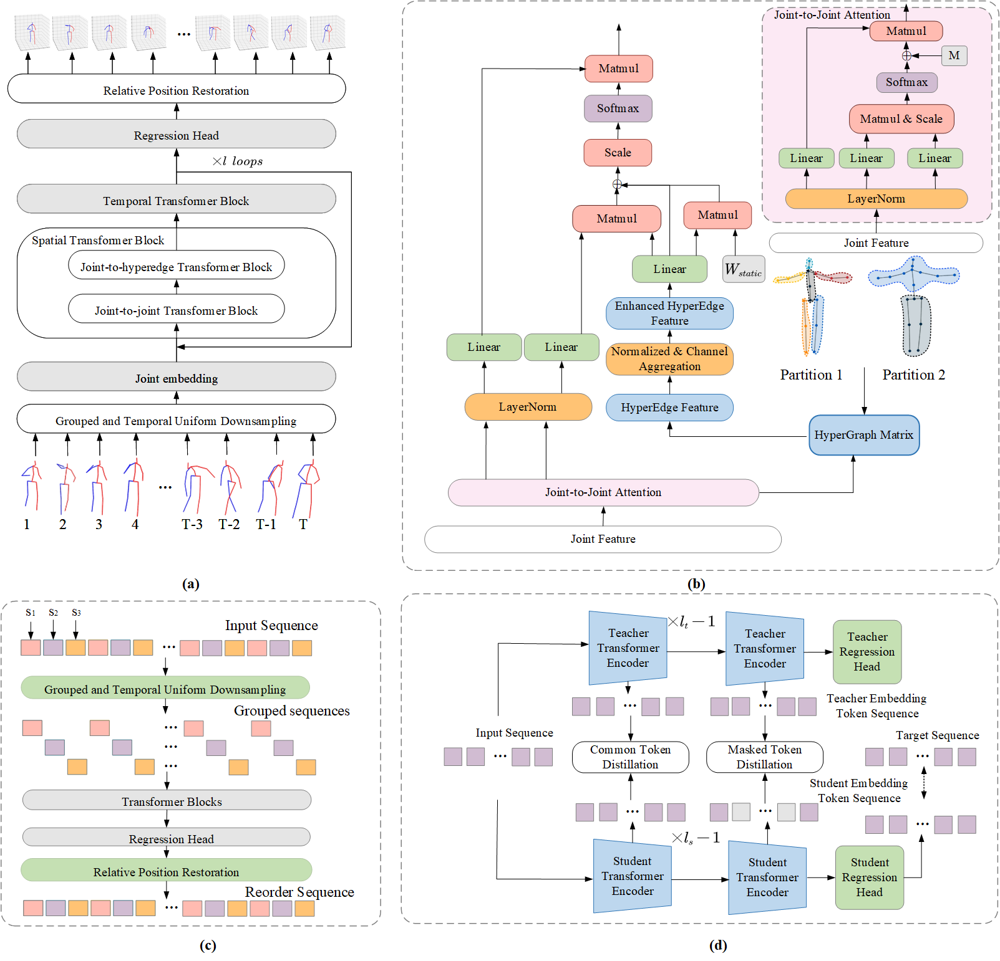

# EHGFormer
This is the official repository of "EHGFormer: An efficient hypergraph-injected transformer for 3D human pose estimation". 

|  |  |  |
| --------------------------------- | -------------------------------------- | --------------------------------------- |


## Network Architecture




## Environment Prepare

### Train and Evaluation

- one GPU RTX 3090(24GB)
- Python 3.8.0
- cuda 11.1

**Detail libraries will be installed by running following command:**

```shell
pip install -r requirements.txt
```

### Inference and Application

See details in [target document](doc/inference.md).

## 3D Human Pose Estimation

See details in [reference document](doc/pose3d.md).

## Skeleton-based Action Recognition

See details in [reference document](doc/action.md).

## Mesh Recovery (Image-based Refine)

See details in [reference document](doc/mesh.md).

## Wild Video Inference

|  |  |
| -------------------------------------- | ----------------------------------- |

See details in [reference document](doc/inference.md).


## Application

### Simple application: Motion capture for skeletal animation


|  |  |  |
| ------------------------------------ | ------------------------------------ | ------------------------------------ |


### Complex application: Animated Drawings

|  |  |  |
| --------------------------------------------------- | --------------------------------------------------- | --------------------------------------------------- |

Detailed instructions see in [Simplified Animated Drawings]([Brian417-cup/AnimatedDrawings: Code to accompany "A Method for Animating Children's Drawings of the Human Figure"](https://github.com/Brian417-cup/AnimatedDrawings)).


## Acknowledgement

Our code is extended from the following repositories. We thank the authors for releasing the codes.

- [MixSTE](https://github.com/JinluZhang1126/MixSTE)
- [MotionBERT](https://github.com/Walter0807/MotionBERT)
- [HyperFormer](https://github.com/ZhouYuxuanYX/Hyperformer)
- [VITKD](https://github.com/yzd-v/cls_KD?tab=readme-ov-file)
- [easy_ViTPose](https://github.com/JunkyByte/easy_ViTPose)
- [live_mocap](https://github.com/EasternJournalist/live_mocap)
- [ROMP](https://github.com/Arthur151/ROMP)
- [HybrIK](https://github.com/Jeff-sjtu/HybrIK)
- [nosmpl](https://github.com/lucasjinreal/nosmpl)
- [pytorch3d](https://github.com/facebookresearch/pytorch3d/tree/38cf0dc1c52138987e6e66295c5a2d192a6914bd)
- [bvhio](https://github.com/Wasserwecken/bvhio)

- [Simplified_Animated_Drawings](https://github.com/Brian417-cup/AnimatedDrawings)
