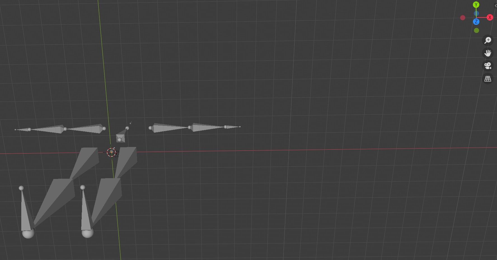

**Attention: The root for following scripts are under `../inference`!!**

We offer trained checkpoints by following link:
[kuake driver link, password is vJV5](https://pan.quark.cn/s/476b28a20489).

# Environment Prepare

**In following operations, we have remove the hard requirement for gpu device, it can use only in CPU due to deploeyment
framework!!**

- Python 3.10.13 and then execute following command in python environment:

```shell
pip install -r requirements.txt
```

- Blender >=2.9.1 (If you want to visualize results of skeleton in [mesh recovery](#Mesh-Recovery)
  and [motion capture complex version for method1](#Application-for-Motion-Capture) part.)

# 2D Pose(Foundamental input data)

Following steps may help you:

1. Please download the checkpoint under **Shared_Checkpoint_3DHPE/Pose2D**, which are for pose 2d and human detection,
   and then put them to [target directory](../inference/vitpose/checkpoints).
2. Currently, we only support 2D pose detector for VITPose, you can change for other poase(OpenPose, AlphaPose, etc) and
   dealt outputs formats like ours for different tasks.
3. For relative configuration, you can modify in [certain config file](../inference/vitpose/config/default_config.yaml)
   if you want make your custom configuration.

# 3D Pose

|  |  || 
| ------------------------------------------------------------ | ------------------------------------------------------------ |------------------------------------------------------------ |

Following steps may help you:

1. Please download the checkpoint under **Shared_Checkpoint_3DHPE/Pose3D** and put them
   to [target directory](../inference/checkpoint).
2. Change `detector_3d.checkpoint_path`'s value in the [certain config file](../inference/cfg/motion_config.yaml), which
   is the path you placed for pose3d checkpoint.
3. Run the following command to infer from the extracted 2D poses:

```bash
python infer_pose3d.py \
--vid_path <your_complete_video_file_path>
```

4. You will see results under [target directory](../inference/output_2dhpe_npz)
   , [target directory](../inference/output_3dhpe).

Here are some tips:

- We offer both `.bin` for raw Pytorch and `.onnx` files for onnxruntime inference.
- Both checkpoints are in **xx_manual1** partition and **xx_manual2** hypergraph partition strategy.
- Both checkpoint for their own partition have 2 version according to **static root joint** or **dynamic root joint**.

# Skeleton-based Action Recognition

Following steps may help you:

1. Please download the checkpoint under **Shared_Checkpoint_3DHPE/Action** and put them
   to [target directory](../inference/checkpoint).
2. Change `action.checkpoint_path`'s value in the [certain config file](../inference/cfg/action_config.yaml), which
3. Run the following command to infer from the extracted 2D poses:

```bash
python infer_action.py \
--vid_path <your_complete_video_file_path>
```

Here are some tips:

- We offer `.onnx` files for onnxruntime inference.
- Both checkpoints are in **xx_manual1** partition hypergraph partition strategy.
- For action label map of NTU dataset, we both offer [NTU60 label map](../inference/cfg/action/label_map_ntu60.txt)
  and [NTU120 label map](../inference/cfg/action/label_map_ntu120.txt). It can be customized by
  changing `action.label_map`'s value in the [certain config file](../inference/cfg/action_config.yaml).

# Mesh Recovery

|  |  || 
| ------------------------------------------------------------ | ------------------------------------------------------------ |------------------------------------------------------------ |

Following steps may help you:

1. Please download the checkpoint under **Shared_Checkpoint_3DHPE/Mesh** and put refine module
   to [target directory](../inference/checkpoint) and HybrIK model
   to [target directory](../inference/vitpose/checkpoints/hybrik).
2. Change `action.checkpoint_path`'s value in the [certain config file](../inference/cfg/mesh_config.yaml), which
3. Run the following command to infer from the extracted 2D poses and image sequnces:

```bash
python infer_mesh.py \
--vid_path <your_complete_video_file_path>
```

Here are some tips:

- We offer `.onnx` files for onnxruntime inference.
- Both checkpoints are in **xx_manual1** partition hypergraph partition strategy.
- For SMPL parameter, we have embeded into **smpl_<gender>.onnx files**
  under [target directory](../inference/checkpoint/mesh).

# Application for Motion Capture

## Simple Version for BVH Generator

|  | 
| ------------------------------------------------------------ | ------------------------------------------------------------ |

We followd [previous method](https://github.com/KevinLTT/video2bvh) to generate bvh.

The prepare is same with [Pose3D section](#3D-Pose), Then, use following command:

```shell
python infer_pose3d_with_bvh.py \
--vid_path <your_complete_video_file_path>
```

Finally, you will see target *.bvh file under [certain directory](../inference/output_3dhpe_bvh).

**Attention: Due to ignoring the issue of joint rotation, this method cannot be effectively used to drive 3D models!!**

## Complex Version for 3D Skeletal Animation

**Following export animtion results are shown by fixed root joint with model trained in static way:**

|  |  || 
| ------------------------------------------------------------ | ------------------------------------------------------------ |------------------------------------------------------------ |

**We follow some IK methods
from [Inverse Kinematics Techniques in Computer Graphics: A Survey](http://www.andreasaristidou.com/publications/papers/IK_survey.pdf)**

### Method1: Optimized and Constrained IK Solver

Using **[blender>= 2.9.1](https://www.blender.org/download/)** or **bpy package** to import *.bvh file and acquire
correspondingly **T-pose(important!!)** *
.fbx model from [MixaMo](https://www.mixamo.com) (You can also use custom *.fbx from other source).

Following steps may help you:

1. If you want to visualize skeleton result, installed Blender at first, and then modify root path of blender's
   directory, which is the value of `mocap.blender_home`
   in [certain config file](../inference/cfg/mocap_config.yaml). Else, do not change anything, program will
   automatically consider bpy package at first.

2. If you want to let final motion capture result seems smoother, set ```smooth_eular```
   in [certain config file](../inference/cfg/mocap_config.yaml) be ```True```, else ```False```

3. Run following script:

```shell
python infer_mocap.py \
--vid_path <your_complete_video_file_path>
```

3. Bind skeleton between source and target model. Here we
   use [Auto-Rig Pro](https://blendermarket.com/products/auto-rig-pro). **This powerful plugin will help to automtically
   in blender when bind skeleton and in the next retarget step**.

```
Attention: Please remember to scale between source *.bvh model and target *.fbx model before target!!
```

4. After scaling the same size between source motion capture model and target model, binding correct skeletons. You are
   expected to  **Retarget model by choosing "Re-Target" button**. Then, you can render animation and export followed *
   .mp4 video in **ViewPort Shading mode**.

5. Export retarget skeleton in *.bvh format ~~use blender GUI~~. You can set one of corresponding config files
   under [certain config file](../inference/cfg/mocap_config.yaml), set ```mocap.bvh.export``` be ```True```. Then, code
   will directly export and you will see the *.bvh file stored under ```output_bvh``` directory
   named ```<your video name>_ik.bvh```.

You can use [bvhacker](https://www.bvhacker.com/) to show your final *.bvh result or directly use blender to visualize (
export default direction is  "y up -z forward" **and please attention: If the export bvh coordinate
format `cfg.mocap.bvh.format` you chosen is `None` ,the direction of T pose is different, the rest pose is placed just
like this: and if `smart_body` you want, the result is normal
currently!!**)

#### Key: About Eular constraint setting

Due to this IK solver has so many hyper parameter, different hyperparameters have different effects. Except above
hyperparameters metioned in above steps, there is another key
hyperparameter [eular constraint in certain file](lib/blender_skeleton/skeleton_config.py),
named ```REST_POSE_BONE_CONSTRAINTS```,following are some realtive settings in code:

```
# two optional eular angle constraint
# # in each tuple, the first is min and the second is max
REST_POSE_BONE_CONSTRAINTS = {
    # Euler angles in world space, where human stands z up, -y back
    # followed yxz
    'LeftArm': ((-45, 45), (-60, 75), (-135, 45)),
    'RightArm': ((-45, 45), (-75, 60), (-45, 135)),

    'LeftForeArm': ((-150, 90), (-5, 5), (-135, 5)),
    'RightForeArm': ((-90, 150), (-5, 5), (-5, 135)),

    'LeftHand': ((-5, 5), (-75, 75), (-30, 30)),
    'RightHand': ((-5, 5), (-75, 75), (-30, 30)),

    # 'Spine': ((-5, 15), (-20, 20), (-20, 20)),
    # 'Spine3': ((-5, 15), (-20, 20), (-20, 20)),
    'Spine': ((-30, 30), (-30, 30), (-45, 45)),
    'Spine3': ((-30, 30), (-30, 30), (-45, 45)),

    # 'Head': ((-30, 30), (-30, 30), (-45, 45)),
    'Neck': ((-30, 30), (-30, 30), (-45, 45)),

    'LeftUpLeg': ((-90, 45), (-45, 60), (-45, 45)),
    'RightUpLeg': ((-90, 45), (-60, 45), (-45, 45)),
    'LeftLeg': ((-5, 135), (-15, 15), (-5, 5)),
    'RightLeg': ((-5, 135), (-15, 15), (-5, 5)),
    'LeftFoot': ((-45, 90), (-15, 15), (-45, 45)),
    'RightFoot': ((-45, 90), (-15, 15), (-45, 45)),
}

# another version from
# https://wiki.secondlife.com/wiki/Suggested_BVH_Joint_Rotation_Limits
# REST_POSE_BONE_CONSTRAINTS = {
#     # Euler angles in world space, where human stands z up, -y back
#     # followed yxz
#     'LeftArm': ((-180, 98), (-135, 90), (-91, 97)),
#     'RightArm': ((-98, 180), (-135, 90), (-97, 91)),
#
#     'LeftForeArm': ((-146, 0), (-90, 79), (0, 0)),
#     'RightForeArm': ((0, 146), (-90, 79), (0, 0)),
#
#     'LeftHand': ((-25, 36), (-45, 45), (-90, 86)),
#     'RightHand': ((-36, 25), (-45, 45), (-86, 90)),
#
#     'Spine': ((0, 0), (0, 0), (0, 0)),
#     'Spine3': ((-45, 45), (-45, 22), (-30, 30)),
#
#     # 'Head': ((-30, 30), (-30, 30), (-45, 45)),
#     'Neck': ((-45, 45), (-37, 22), (-30, 30)),
#
#     'LeftUpLeg': ((-85, 105), (-155, 45), (-17, 88)),
#     'RightUpLeg': ((-105, 85), (-155, 45), (-88, 17)),
#     'LeftLeg': ((0, 0), (0, 150), (0, 0)),
#     'RightLeg': ((0, 0), (0, 150), (0, 0)),
#     'LeftFoot': ((-26, 26), (-31, 63), (-74, 15)),
#     'RightFoot': ((-26, 26), (-31, 63), (-15, 74)),
# }
```` 

You can try one of them or make your own eular constraint for corresponding bone.

### Method2: Learned-method by SMPL

Use following command, which is same with human mesh recovery:

```shell
python infer_mesh.py \
--vid_path <your_complete_video_file_path>
```

- We automatically export *.fbx and *.bvh files when infer mesh recovery. [Key script](../inference/tool/convert2fbx.py)
  is provided by [ROMP](https://github.com/Arthur151/ROMP) and execute in Blender environment or embeded bpy. It is
  controled by key parameter `mocap.fbx_export` and `mocap.bvh_export`
  in [target config file](../inference/cfg/mesh_config.yaml).
- You can also set key parameters in [target config file](../inference/cfg/mesh_config.yaml), it includes
  `mocap.bpy.target_script_path`, `mocap.bpy.male_model_path`, `mocap.bpy.female_model_path`
  , `mocap.bpy.character_model_path`.

**Attention: Target \*.fbx source models for Unity comes from [official SMPL website](https://smpl.is.tue.mpg.de/),
please follow their corresponding license.**

Currently, this method is under a **fixed camera condition!!**